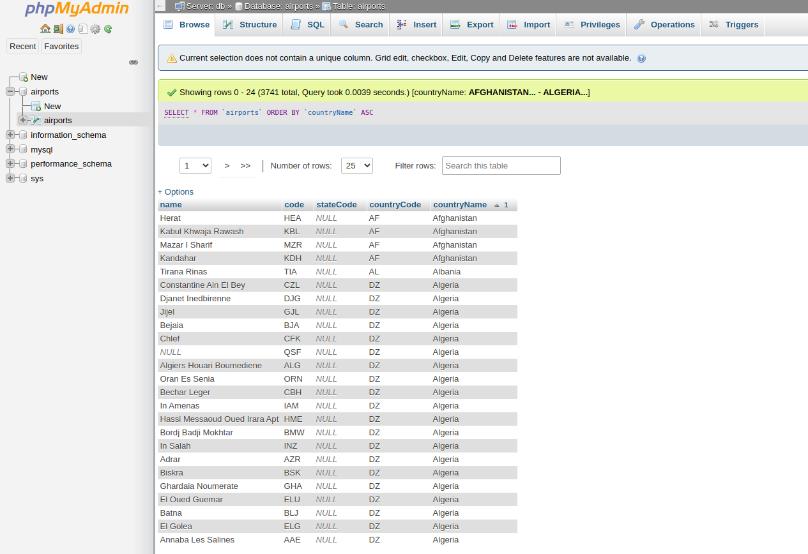

# Dockerfile-Airports-with-IATACodes
Dockerfile to build a MySQL container image with the International airports database with IATA codes.

Used in the course DEVOPS FOR DATA SCIENTISTS https://i2ds.org/programa-devops-data-scientists/

## Build the image

Build a custom image using the Dockerfile:
```
docker build -t mysql_airports:latest  .
```

## Run MySQL container

Run a mysql container with the new image:
```
docker run --name some-mysql -e MYSQL_ROOT_PASSWORD=my-secret-pw -d mysql_airports:latest
```

## Run PHPMyAdmin container

Run PHP My Admin container and link it to the mysql containe:
```
docker run --name myadmin -d --link some-mysql:db -p 8080:80 -e MYSQL_ROOT_PASSWORD=my-secret-pw phpmyadmin
```

Access de UI at: https://localhost:8080 and navigate to the airports database to see its content



